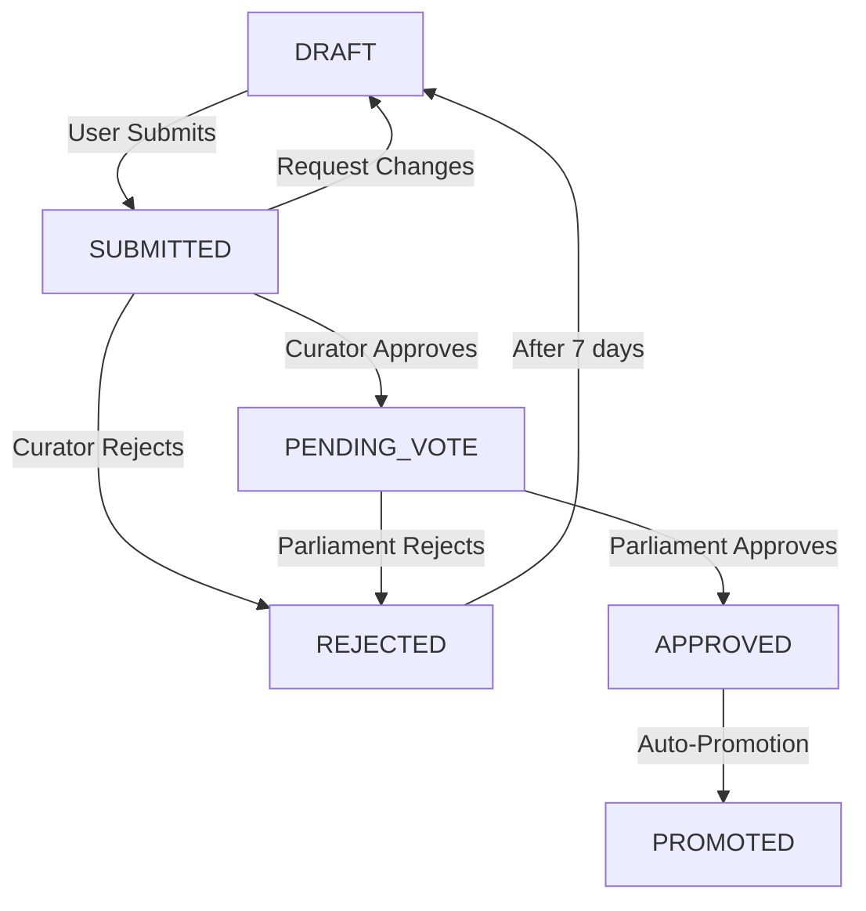

# Portfolio Submission & Review System

This document explains the complete flow of the portfolio submission, review, voting, and promotion system.

---

## 🔄 Complete Flow Overview

```
User Creates Portfolio → Submits for Review → Curator Reviews → Parliament Votes → Auto-Promotion
     (Draft)                (Submitted)         (Pending Vote)       (Approved/Rejected)
```

---

## 1️⃣ User Creates & Submits Portfolio

### Frontend: [Portfolio.jsx](liquidweb/src/pages/Portfolio.jsx)

**Location:** `/portfolio` page

**User Actions:**
1. Select target guild role
2. Add Twitter username
3. Add tweet URLs (stored as available tweets)
4. Add other works (optional links)
5. Add proof of use/Notion URL (optional)
6. Click "Submit Portfolio for Review"

**Submit Handler:** [`handleSubmitPortfolio()`](liquidweb/src/pages/Portfolio.jsx#L312)

**Flow:**
```javascript
1. Validate required fields (twitter_username, at least 1 tweet)
2. Show confirmation: "Submit for review? You won't be able to edit..."
3. Call: POST /api/portfolio/save (save draft with all data)
4. Call: POST /api/portfolio/submit { discord_id }
5. Redirect to: /portfolios/{discord_id}
```

### Backend: [portfolio.py](backend/src/api/routers/portfolio.py#L244)

**Endpoint:** `POST /api/portfolio/submit`

**Process:**
```python
1. Find portfolio with status: draft, submitted, or rejected
2. Validate twitter_handle is present
3. Update portfolio:
   - status = "submitted"
   - submitted_at = now()
4. Commit to database
5. Return portfolio data
```

**Database Status:** `SUBMITTED`

---

## 2️⃣ Curator/Staff Reviews Portfolio

### Frontend: [Portfolios.jsx](liquidweb/src/pages/Portfolios.jsx)

**Location:** `/portfolios` page (Review dashboard)

**Who Can Review:**
- Guild Leader (role: 1449066131741737175)
- Parliament (role: 1447972806339067925)
- Staff (role: 1436799852171235472)
- Automata (role: 1436233268134678600)
- Moderator (role: 1436217207825629277)

**Review Actions:**
1. **Approve** → Sends to Parliament for voting
2. **Reject** → Portfolio rejected with reason
3. **Request Changes** → Back to draft with feedback

**Review Handler:** `handleReview()` in [Portfolios.jsx](liquidweb/src/pages/Portfolios.jsx)

### Backend: [portfolio.py](backend/src/api/routers/portfolio.py#L275)

**Endpoint:** `POST /api/portfolio/review`

**Request:**
```json
{
  "discord_id": "123456789",
  "reviewer_id": "987654321",
  "action": "approve|reject|request_changes",
  "feedback": "Optional feedback text"
}
```

**Process for APPROVE:**
```python
1. Find portfolio with status = "submitted"
2. Set portfolio.status = "pending_vote"
3. Set portfolio.reviewer_id = reviewer's Discord ID
4. Set portfolio.reviewed_at = now()
5. Set portfolio.review_feedback = feedback
6. Calculate voting_deadline = now() + 24 hours
7. Create Discord embed with voting info
8. Send to Parliament channel with voting buttons
9. Return { success: true, discord_message_id }
```

**Discord Embed Structure:**
```javascript
{
  title: "voting",
  description: "@reviewer approved this portfolio for @Parliament voting.\n⏰ deadline: <in 24h>",
  fields: [
    { name: "user", value: "@user_mention" },
    { name: "target guild", value: "@guild_role or name" },
    { name: "portfolio", value: "[view portfolio](url)" }
  ],
  footer: "portfolio id: X • voting ends in 24h or when all parliament members vote"
}
```

**Voting Buttons:**
- ✅ Approve (green) - Shows vote count
- ❌ Reject (red) - Shows vote count
- 🗑️ Withdraw (gray) - Portfolio owner can withdraw

**Database Status:** `PENDING_VOTE`

**Process for REJECT:**
```python
1. Set portfolio.status = "rejected"
2. Set portfolio.rejection_reason = feedback
3. User has 7-day cooldown before resubmit
```

**Process for REQUEST_CHANGES:**
```python
1. Set portfolio.status = "draft"
2. Set portfolio.review_feedback = feedback
3. User can edit and resubmit immediately
```

---

## 3️⃣ Parliament Votes on Portfolio

### Discord Bot: [parliament_command.py](src/bot/commands/parliament_command.py#L578)

**Who Can Vote:**
- Parliament role members (1447972806339067925)
- Server administrators

**Vote Buttons:**
- Custom IDs: `portfolio_vote_approve_{discord_id}`, `portfolio_vote_reject_{discord_id}`
- Listener: `portfolio_vote_listener()` on `on_interaction` event

**Vote Handler:** `handle_portfolio_vote()`

**Flow:**
```python
1. Check user has Parliament role
2. Record vote: POST /api/portfolio/vote
   - discord_id
   - voter_discord_id
   - vote_type (approve/reject)
3. Update button labels with new vote counts
4. Check if voting is complete: GET /api/portfolio/vote-check/{discord_id}
5. If ready, finalize: POST /api/portfolio/finalize
```

### Backend Vote Recording: [portfolio.py](backend/src/api/routers/portfolio.py)

**Endpoint:** `POST /api/portfolio/vote`

**Process:**
```python
1. Find portfolio with status = "pending_vote"
2. Check if user already voted (prevent duplicate votes)
3. Create PortfolioVote record:
   - portfolio_id
   - voter_discord_id
   - vote_type (approve/reject)
4. Return current vote counts
```

**Vote Check Logic:**
```python
- Get total Parliament member count
- Count unique voters
- If all voted OR 24h deadline passed:
  - approved = (approve_count > reject_count)
  - return { ready: true, approved: true/false }
```

---

## 4️⃣ Finalize Portfolio (Auto-Promotion)

### Backend: [portfolio.py](backend/src/api/routers/portfolio.py)

**Endpoint:** `POST /api/portfolio/finalize`

**Process for APPROVED:**
```python
1. Set portfolio.status = "approved"
2. Get user's current guild membership
3. Calculate next tier role from roles.yaml
4. Update guild member tier in database
5. Create portfolio history record
6. Return { success: true, to_role: "role_name" }
```

### Discord Bot Auto-Role Assignment:

**In parliament_command.py:**
```python
1. Get member object from Discord
2. Get next tier role from roles.yaml config
3. Assign role: member.add_roles(role)
4. Update Discord embed:
   - Color: Green
   - Title: "✅ Portfolio Approved"
   - Add field: "🎖️ Promotion - @user promoted to RoleName (Tier X)!"
5. Disable voting buttons
```

**Process for REJECTED:**
```python
1. Set portfolio.status = "rejected"
2. Set rejection_reason based on vote
3. Apply 7-day resubmit cooldown
4. Update Discord embed to red with rejection message
```

---

## 📊 Portfolio Status Lifecycle



---

## 🗄️ Database Models

### Portfolio Table ([portfolio.py](backend/src/models/portfolio.py))

```python
class Portfolio:
    id: int
    user_id: int
    discord_id: str
    
    # Content
    notion_url: str | None
    bio: str | None
    twitter_handle: str | None
    achievements: str | None
    other_works: str | None  # JSON array
    
    # Target
    target_role: str | None
    current_role: str | None
    
    # Status
    status: str  # draft, submitted, pending_vote, approved, rejected, promoted
    
    # Review
    reviewer_id: str | None
    review_feedback: str | None
    rejection_reason: str | None
    
    # Timestamps
    created_at: datetime
    updated_at: datetime
    submitted_at: datetime | None
    reviewed_at: datetime | None
    voting_deadline: datetime | None
    
    # Relationships
    tweets: List[PortfolioTweet]
    history: List[PortfolioHistory]
    votes: List[PortfolioVote]
```

### PortfolioVote Table

```python
class PortfolioVote:
    id: int
    portfolio_id: int
    voter_discord_id: str
    vote_type: str  # "approve" or "reject"
    created_at: datetime
```

### PortfolioHistory Table

```python
class PortfolioHistory:
    id: int
    portfolio_id: int
    discord_id: str
    from_role: str
    to_role: str
    snapshot_data: str  # JSON
    promoted_at: datetime
```

---

## 🔑 Key Configuration

### Discord Channel IDs:
- **Parliament Channel:** Defined in `PARLIAMENT_CHANNEL_ID` env variable
- Where voting messages are posted

### Role IDs (from [Portfolios.jsx](liquidweb/src/pages/Portfolios.jsx)):
```javascript
REVIEWER_ROLES = [
    '1449066131741737175', // Guild Leader
    '1447972806339067925', // Parliament
    '1436799852171235472', // Staff
    '1436233268134678600', // Automata
    '1436217207825629277', // Moderator
]
```

### Timing:
- **Voting Deadline:** 24 hours from approval
- **Rejection Cooldown:** 7 days (defined as `RESUBMIT_COOLDOWN_DAYS`)

---

## 🎯 Important Features

### 1. **Cooldown System**
- After rejection, user must wait 7 days to resubmit
- Check via: `GET /api/portfolio/{discord_id}/can-resubmit`
- Returns: `{ can_resubmit: bool, cooldown_ends: datetime, days_remaining: int }`

### 2. **Portfolio Viewing**
- Anyone can view portfolios at `/portfolios/{discord_id}`
- Shows full portfolio with status, tweets, works, etc.
- Different views based on status (draft, under review, voting, approved, rejected)

### 3. **Tweet Integration**
- Tweets embedded using TweetCard component
- Tweet URLs extracted and IDs parsed
- Stored in `portfolio_tweets` table with portfolio_id relationship

### 4. **Auto-Promotion**
- On approval, user is automatically promoted to next tier
- Role assigned via Discord bot
- Guild tier updated in database
- History record created for tracking

### 5. **Withdraw Option**
- Portfolio owner can withdraw from voting
- Button: 🗑️ on voting message
- Sets status back to draft
- Deletes voting message

---

## 📍 Key Files Reference

### Frontend:
- [Portfolio.jsx](liquidweb/src/pages/Portfolio.jsx) - User portfolio creation/editing
- [Portfolios.jsx](liquidweb/src/pages/Portfolios.jsx) - Review dashboard for curators
- [PortfolioView.jsx](liquidweb/src/pages/PortfolioView.jsx) - Individual portfolio view
- [AuthCallback.jsx](liquidweb/src/pages/AuthCallback.jsx) - Redirects to /portfolio after login

### Backend:
- [portfolio.py (routes)](backend/src/api/routers/portfolio.py) - All API endpoints
- [portfolio.py (models)](backend/src/models/portfolio.py) - Database models
- [parliament_command.py](src/bot/commands/parliament_command.py) - Discord voting bot

### Config:
- `config/roles.yaml` - Guild role tier definitions
- Environment vars: `PARLIAMENT_CHANNEL_ID`, `FRONTEND_URL`

---

## 🚀 API Endpoints Summary

| Method | Endpoint | Description |
|--------|----------|-------------|
| GET | `/api/portfolio/{discord_id}` | Get portfolio data |
| POST | `/api/portfolio/save` | Save draft portfolio |
| POST | `/api/portfolio/submit` | Submit portfolio for review |
| POST | `/api/portfolio/review` | Curator reviews (approve/reject/changes) |
| POST | `/api/portfolio/vote` | Parliament member votes |
| GET | `/api/portfolio/vote-check/{discord_id}` | Check if voting is complete |
| POST | `/api/portfolio/finalize` | Finalize voting and promote/reject |
| DELETE | `/api/portfolio/{discord_id}` | Delete portfolio |
| GET | `/api/portfolio/{discord_id}/can-resubmit` | Check resubmit cooldown |
| GET | `/api/portfolio/{discord_id}/history` | Get promotion history |

---

## 🎨 Status Display Colors

```javascript
draft:         Gray   (#64748b)
submitted:     Blue   (#3b82f6) "Under Review"
pending_vote:  Purple (#a855f7) "Parliament Vote"
approved:      Green  (#22c55e) "Approved"
promoted:      Green  (#22c55e) "Promoted"
rejected:      Red    (#ef4444) "Rejected"
```

---

This system provides a complete workflow from user submission to automatic promotion with Discord integration, voting mechanisms, and proper access controls.
